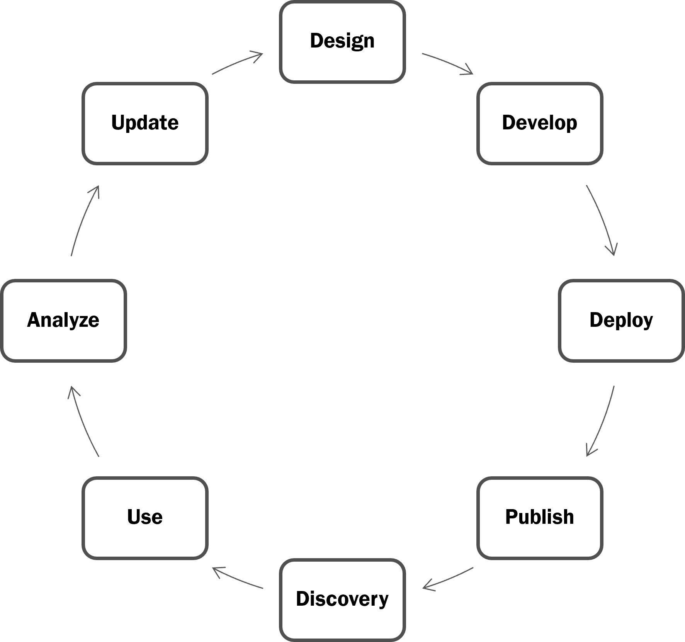

# adidas API Maturity Framework

<figure><figcaption><p>adidas Logo</p></figcaption></figure>

## Motivation

The API Maturity Framework is intended to be a continuous improvement tool for adidas APIs, providing consistent criteria to define an improvement path for API architects and engineers.

This framework provides a clear roadmap for API development and lifecycle management. By sharing this comprehensive guide, we empower teams to enhance their API best practices, ensuring consistency, quality, and innovation.

Fully aligned with[ Adidas API Guidelines](https://adidas.gitbook.io/api-guidelines), this framework focuses primarily on API evolution across different levels. It also offers a method to establish the current level in each phase but always fostering the improvement and evolution.&#x20;

## Framework

The framework is structured according to the Adidas API Lifecycle.

<figure><figcaption><p>adidas API Lifecycle</p></figcaption></figure>

Each phase encompasses distinct levels:

* Crawl
* Walk
* Run
* Fly

It’s important to note that **reaching each level requires fulfilling all the requirements of the previous** levels.

## How to read this framework

adidas API Maturity Framework is available for online reading at [GitBook](https://adidas.gitbook.io/api-guidelines/). The source code can be found on [GitHub](https://github.com/adidas/api-maturity-framework).

The CAPITALIZED words throughout these guidelines have a special meaning:

```
1. MUST: This word, or the terms "REQUIRED" or "SHALL", mean that the
   definition is an absolute requirement of the specification.

2. MUST NOT: This phrase, or the phrase "SHALL NOT", mean that the
   definition is an absolute prohibition of the specification.

3. SHOULD: This word, or the adjective "RECOMMENDED", mean that there
   may exist valid reasons in particular circumstances to ignore a
   particular item, but the full implications must be understood and
   carefully weighed before choosing a different course.

4. SHOULD NOT: This phrase, or the phrase "NOT RECOMMENDED" mean that
   there may exist valid reasons in particular circumstances when the
   particular behavior is acceptable or even useful, but the full
   implications should be understood and the case carefully weighed
   before implementing any behavior described with this label.
```

Refer to [RFC2119](https://www.rfc-editor.org/rfc/rfc2119) for details.

## API Maturity Assessment

TBD

## Collaborate & Contact

If you have any questions or feedback, please feel free to use the appropriate GitHub collaboration tools, such as **Issues**, **Pull Requests**, or **Discussions**.

For inquiries specifically related to these guidelines, you are welcome to contact the adidas API Team via email at [**api-team@adidas.com**](mailto:api-team@adidas.com).

## Last Review

June 2025

## License and Software Information

© adidas AG

adidas AG publishes this software and accompanied documentation (if any) subject to the terms of the MIT license with the aim of helping the community with our tools and libraries which we think can be also useful for other people. You will find a copy of the MIT license in the root folder of this package. All rights not explicitly granted to you under the MIT license remain the sole and exclusive property of adidas AG.

NOTICE: The software has been designed solely for the purpose of providing API design and development guidelines. The software is NOT designed, tested or verified for productive use whatsoever, nor or for any use related to high-risk environments, such as health care, highly or fully autonomous driving, power plants, or other critical infrastructures or services.

For further information open the [adidas terms and conditions](https://github.com/adidas/adidas-contribution-guidelines/wiki/Terms-and-conditions) page.
